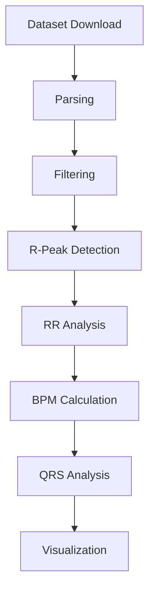

# ecg-analysis

An educational but production-quality ECG analysis repository built around the open-source MIT-BIH Arrhythmia Database from PhysioNet. The project demonstrates a complete workflow from dataset download to signal processing, feature extraction, visualization, and notebook exploration.

## Project Overview

This repository covers the essential steps in a standard ECG analysis pipeline:

- Download the MIT-BIH Arrhythmia Database from PhysioNet.
- Parse ECG recordings and beat annotations.
- Filter raw ECG signals with a Butterworth band-pass filter.
- Detect R-peaks using NeuroKit2.
- Compute RR intervals and BPM.
- Perform a basic QRS analysis.
- Generate static figures for reporting and inspection.
- Explore the workflow interactively in a Jupyter notebook.

The code is organized as a small Python package so that each processing step can be tested independently and reused in notebooks or scripts.

## MIT-BIH Arrhythmia Database

The MIT-BIH Arrhythmia Database is one of the most widely used ECG benchmark datasets in biomedical signal processing. It contains 48 half-hour two-channel ambulatory ECG recordings sampled at 360 Hz with expert annotations for arrhythmic beats.

Why this dataset is useful:

- It is publicly available through PhysioNet.
- It is annotated and widely cited in research.
- It provides realistic ECG morphology and rhythm variation.
- It is ideal for learning, prototyping, and benchmarking classic ECG methods.

Dataset source: [PhysioNet MIT-BIH Arrhythmia Database](https://physionet.org/content/mitdb/1.0.0/)

## Architecture



A more detailed architecture note is available in [docs/architecture.md](docs/architecture.md).

## Installation

The project targets Python 3.11+.

```bash
pip install -r requirements.txt
```

If you want to work in an isolated environment:

```bash
python -m venv .venv
source .venv/bin/activate
pip install -r requirements.txt
```

## Repository Structure

```text
ecg-analysis/
├── README.md
├── requirements.txt
├── .gitignore
├── LICENSE
├── data/
│   └── .gitkeep
├── docs/
│   └── architecture.md
├── notebooks/
│   └── 01_ecg_exploration.ipynb
├── src/
│   ├── __init__.py
│   ├── download_dataset.py
│   ├── ecg_parser.py
│   ├── filters.py
│   ├── rpeak_detection.py
│   ├── bpm_analysis.py
│   ├── qrs_analysis.py
│   └── visualization.py
├── examples/
│   └── run_analysis.py
└── tests/
        ├── test_filters.py
        ├── test_bpm.py
        └── test_parser.py
```

## Usage

### 1. Download the dataset

```bash
python -m src.download_dataset --output-dir data/mitdb
```

The downloader uses `wfdb.dl_database()` and stores the records in `data/mitdb`.

### 2. Run the end-to-end analysis

```bash
python examples/run_analysis.py --record 100
```

Optional arguments:

- `--dataset-dir`: path to the MIT-BIH dataset root.
- `--output-dir`: location where figures should be written.

### 3. Run the tests

```bash
pytest
```

## Methodology

The pipeline is intentionally conservative and easy to follow:

1. Load the raw ECG record and the MIT-BIH annotations.
2. Apply a Butterworth band-pass filter with default bounds of 0.5 Hz to 40 Hz.
3. Detect R-peaks using NeuroKit2 as the primary algorithm.
4. Convert peak locations to RR intervals.
5. Derive instantaneous BPM and average BPM.
6. Estimate QRS duration and summarize R-wave amplitudes.
7. Save the raw, filtered, and peak-marked ECG plots to PNG files.

### BPM Calculation Formula

RR intervals are computed in seconds from successive R-peak locations:

$$
RR_i = \frac{r_{i+1} - r_i}{f_s}
$$

Instantaneous BPM is then:

$$
BPM_i = \frac{60}{RR_i}
$$

The average BPM is the mean of the instantaneous BPM values.

### QRS Analysis

The QRS analysis in this project focuses on a small set of interpretable features:

- R-wave amplitudes at detected R-peak positions.
- Average R-wave amplitude.
- Estimated QRS duration in milliseconds.
- Beat count.

The implementation tries NeuroKit2 delineation first and falls back to a local width-based estimate when delineation is unavailable or unstable.

## Example Output

```text
------------------------------------------------
Record: 100
Sampling frequency: 360 Hz
Detected beats: 2273
Average BPM: 72.4
Mean RR interval: 0.83 s
Mean QRS duration: 96 ms
------------------------------------------------
```

The exact values may vary slightly depending on signal preprocessing and the chosen detection backend.

## Notebook

The notebook at [notebooks/01_ecg_exploration.ipynb](notebooks/01_ecg_exploration.ipynb) walks through:

- dataset loading
- raw ECG plotting
- filtered ECG plotting
- R-peak detection
- BPM calculation
- QRS statistics

It is structured to run top to bottom without manual cell reordering.

## Testing

The test suite focuses on the most stable parts of the pipeline:

- Filter output length and numerical validity.
- RR interval and BPM calculations.
- Parser output shape and metadata handling.

These tests use synthetic data and lightweight stubs so they can run without downloading the dataset.

## Visualization Outputs

The plotting functions write PNG files to `outputs/figures/`.

Generated files include:

- `<record>_raw_ecg.png`
- `<record>_filtered_ecg.png`
- `<record>_r_peaks.png`

## Future Improvements

- Add a Pan-Tompkins R-peak detector backend.
- Add HRV time-domain and frequency-domain analysis.
- Compare detected peaks against MIT-BIH annotations quantitatively.
- Add beat-level arrhythmia classification.
- Add batch analysis across multiple records.
- Add CLI support for selecting channels and saving CSV summaries.

## References

- [PhysioNet MIT-BIH Arrhythmia Database](https://physionet.org/content/mitdb/1.0.0/)
- WFDB Python Package: [wfdb.readthedocs.io](https://wfdb.readthedocs.io/)
- NeuroKit2: [neuropsychology.github.io/NeuroKit/](https://neuropsychology.github.io/NeuroKit/)