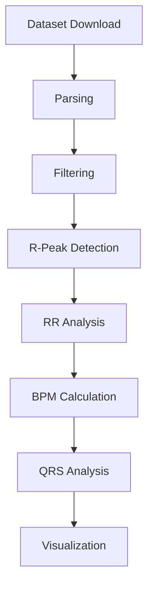

# Architecture

This project follows a small, testable, pipeline-oriented design.

## Modules

- `src/download_dataset.py`: Downloads the MIT-BIH Arrhythmia Database from PhysioNet.
- `src/ecg_parser.py`: Loads WFDB records and annotations.
- `src/filters.py`: Applies Butterworth band-pass filtering.
- `src/rpeak_detection.py`: Detects R-peaks using NeuroKit2 with a fallback detector.
- `src/bpm_analysis.py`: Computes RR intervals and BPM metrics.
- `src/qrs_analysis.py`: Extracts basic QRS metrics.
- `src/visualization.py`: Saves ECG plots to PNG files.

## Data Flow

1. Download the dataset into `data/mitdb`.
2. Load a specific record and its annotations.
3. Filter the ECG to reduce baseline wander and high-frequency noise.
4. Detect R-peaks from the filtered waveform.
5. Derive RR intervals and BPM.
6. Estimate QRS duration and R-wave amplitude statistics.
7. Persist plots under `outputs/figures`.

## Design Notes

- The pipeline is intentionally lightweight and easy to extend.
- External dependencies are isolated to small modules so each step is independently testable.
- The plotting layer writes files instead of showing figures, which keeps the project script-friendly and notebook-friendly.
